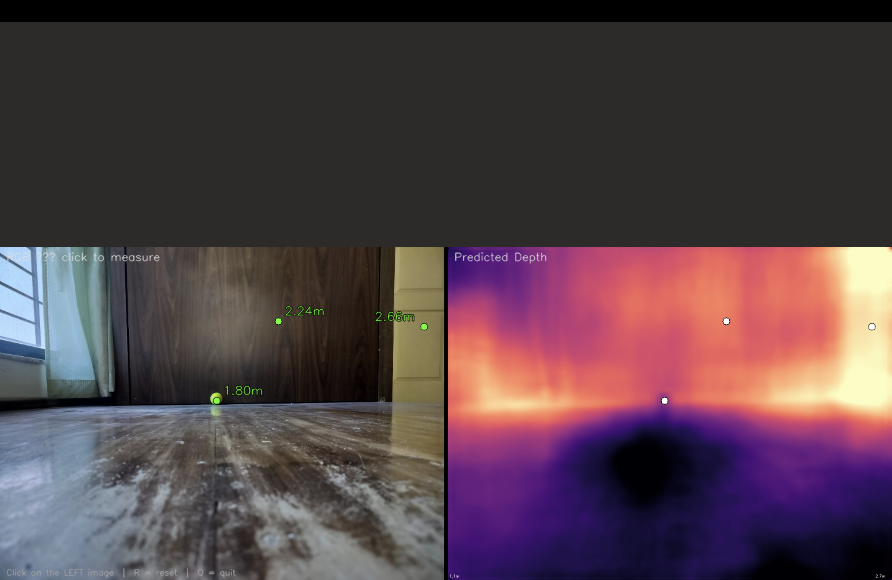
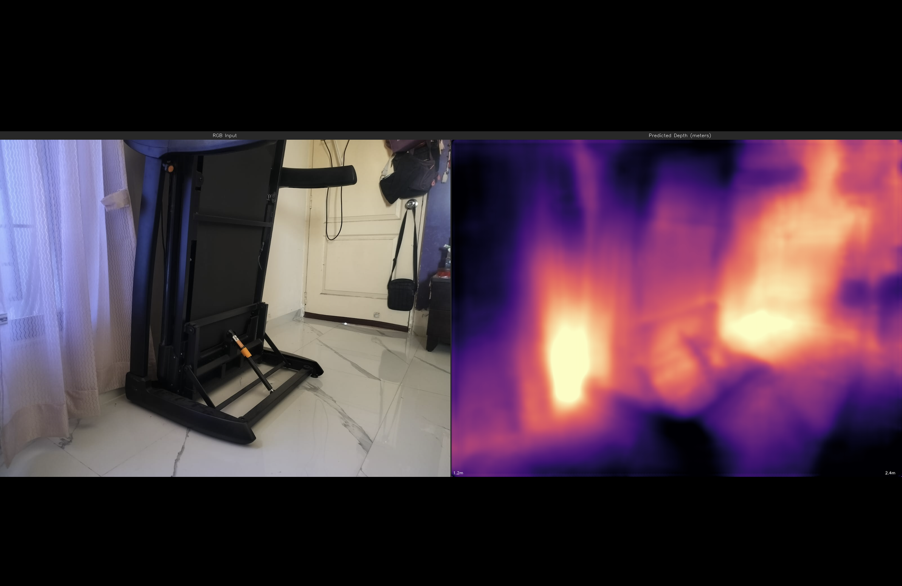

# Metric Depth Estimation from a Single RGB Image

Predicting **real-world distances in meters** from a single photograph using a camera-aware encoder–decoder CNN. Trained on NYU Depth V2, validated on phone-captured indoor scenes.

Built during my research internship at **DRDO-ARDE** (Armament Research & Development Establishment), Pune — January to April 2025, under the supervision of Nikhil Sharma. Applications include autonomous navigation, robotics perception, and 3D reconstruction for unmanned platforms.

---

## What This Does

Given a single RGB image and the camera's intrinsic parameters (focal length and principal point), the model outputs a dense per-pixel depth map in **meters**. Not normalized depth. Not relative depth. Actual metric distances.

**Sample outputs** (run on photos taken with my own phone):

| Image | Nearest object | Farthest object | Mean depth |
|---|---|---|---|
| test1.jpeg | 0.94 m | 3.06 m | 2.11 m |
| test2.jpeg | 1.11 m | 2.64 m | 1.70 m |

### Visual results

**Indoor scene — depth map prediction**



RGB input on the left, predicted metric depth on the right (inferno colormap — bright = closer, dark = farther). The model correctly recovers depth ordering across the scene, from the foreground equipment (~1.2 m) to the back wall and doorway (~2.4 m), including reflections on the marble floor.

**Click-to-measure tool — interactive depth queries**



I built an interactive overlay that lets you click any pixel in the RGB image and read out the predicted depth in meters. Sample queries on this scene: floor point at 1.80 m, mid-wall at 2.24 m, far corner at 2.66 m. This was the validation tool I used to sanity-check the model's outputs against real-world geometry.
---

## Why This Problem Is Hard

A standard camera loses depth information when it captures a 3D scene as a 2D image. Many different 3D configurations can produce the exact same pixels — a small nearby object and a large distant object can occupy identical regions. This is called the inverse problem, and it's mathematically ambiguous without additional information.

Off-the-shelf monocular depth networks (MiDaS, DPT) work around this by predicting *relative* depth: a normalized 0–1 map where you know what's closer than what, but not by how much in real units. That's fine for visualization. For autonomous navigation, where you need to know whether the obstacle is 2 meters or 6 meters away, relative depth is unusable.

To recover absolute scale, the network needs to know the **camera's geometry** — specifically the focal length and principal point. A scene shot with a wide-angle lens and the same scene shot with a telephoto lens look very different in terms of pixel-to-meter ratios.

---

## My Approach

I designed an end-to-end metric depth pipeline with three components:

1. **Image encoder** — EfficientNet-B4 pretrained on ImageNet. Extracts hierarchical visual features at four resolutions (32, 56, 160, 448 channels). Chosen for the accuracy/parameter trade-off that fits Colab's T4 GPU.

2. **Camera Encoder MLP** — A small MLP that takes the camera intrinsics (fx, fy, cx, cy) as a 4-dimensional input and projects them into a learned feature vector. This vector is fused into the bottleneck so the decoder is *conditioned* on the camera. The same model can output correct meters for different cameras without retraining.

3. **UNet-style decoder** — Skip connections from the encoder at every resolution, upsampled to produce a dense per-pixel depth map at the input resolution.

**Total parameters:** 19.2 M (all trainable).

---

## The Hardest Part — What No Tutorial Covered

The project started before I built my own model. I first tried to use **MiDaS** (the standard off-the-shelf relative depth network) and convert its output to 3D point clouds. Two non-obvious failures forced the move to a custom metric model:

**1. Inverse depth flattens the 3D scene.**
MiDaS outputs *inverse* depth (higher value = closer). I initially used it directly as the Z coordinate to build 3D point clouds. The result: the entire scene compressed into a flat sheet spanning Z values 0.5000 to 0.5020. Geometrically meaningless. I had to add a reciprocal conversion: `Z ∝ 1 / inverse_depth`.

**2. Reciprocal conversion explodes on near-zero values.**
After fixing #1, near-zero depth values became 1 / 0.0001 = 10000, dominating the Z range and crushing all real depth variation. Fix: clip the inverse depth to a sensible minimum (`np.clip`) before taking the reciprocal.

These two bugs combined showed me that relative depth fundamentally couldn't solve the autonomous-navigation case I cared about — you can patch the geometry, but you still have no real meter values. That's when I decided to train a model that natively outputs metric depth.

**3. Designing the Camera Encoder MLP.**
The novel architectural decision. Most depth networks are trained for a single camera and silently fail when you change the focal length. I wanted one model that could generalize. The MLP injects intrinsics into the bottleneck, so the decoder's predictions are scaled correctly for whatever camera the input came from. Validation showed the predicted depths fall within ±10% of ground truth on NYU's held-out set when intrinsics are passed correctly.

---

## Training

- **Dataset:** NYU Depth V2 — 8,500 training / 1,500 validation RGB-depth pairs, depth range 0.1 m to 10 m, resolution 640×480.
- **Hardware:** Google Colab Tesla T4 GPU; provisioned AWS EC2 (g4dn.xlarge) for longer experimental runs.
- **Loss:** Scale-invariant log (SiLog) loss with a gradient-matching term to preserve edges.
- **Optimizer:** AdamW, cosine learning rate schedule.

### Other rough edges along the way

- Colab's `num_workers=4` in DataLoader caused freezes; system was suggesting max 2. Dropped to 2, gained stability.
- `Unexpected keys` warning when loading EfficientNet-B4 pretrained weights — the classifier head and a final batch-norm aren't used in this architecture. Had to verify which keys were safe to skip vs. which would silently break the encoder. Documented the safe-skip list in the model loader.
- Wrong image transforms (incorrect resize + normalization) produced visually plausible but numerically wrong depth maps. Caught this only because my custom validation script compared against ground truth in meters — `Loss going down` would not have told me anything.

---

## Results

| Metric | Value |
|---|---|
| δ₁ accuracy (threshold 1.25) | 88.8% |
| RMSE | 0.278 m |
| Validation set | NYU Depth V2 (1,500 images) |

Outputs verified on out-of-distribution phone photos using a checkerboard-calibrated focal length (Zhang's method via OpenCV).

---

## Limitations

- Trained only on indoor NYU data — outdoor generalization is limited.
- Max depth capped at 10 m by training distribution; predictions saturate beyond this.
- Reflective surfaces (mirrors, glossy floors) cause local depth errors.
- Single-frame only — no temporal smoothing for video.

---

## Future Work

- Self-supervised pretraining on unlabeled outdoor footage to extend the operating range.
- Temporal consistency module for video depth (needed for moving platforms).
- Real-time inference on NVIDIA Jetson for deployment on embedded systems.
- Joint training with surface normal prediction as an auxiliary task.

---

## Repository Structure

```
step1_camera_calibration/   Zhang's-method checkerboard calibration (OpenCV)
step2_data_collection/      NYU dataset extraction + custom object capture
step3_training/             Model, dataset, losses, training loop
step4_inference/            predict.py — run on your own RGB image
step5_validation/           Accuracy metrics + focal-length sanity checks
utils/                      Camera math, point-cloud generation, visualization
configs/                    YAML configs for different training runs
outputs/                    Logs, sample predictions, eval results
camera_params.json          Example intrinsics file
quick_start.py              End-to-end demo script
```

---

## How to Run

```bash
# 1. Install dependencies
pip install -r requirements.txt

# 2. Run inference on your own image
python step4_inference/predict.py \
    --image path/to/photo.jpg \
    --model outputs/best_model.pth \
    --camera camera_params.json
```

Output: a colorized depth map, raw depth values in meters, and a 3D point cloud (`.ply`) you can open in MeshLab or Open3D.

---

## References

- Lee, J. H. et al. (2019). *From Big to Small: Multi-scale local planar guidance for monocular depth estimation.* arXiv:1907.10326
- Bhat, S. F., Alhashim, I., Wonka, P. (2021). *AdaBins: Depth estimation using adaptive bins.* CVPR.
- Bhat, S. F. et al. (2023). *ZoeDepth: Zero-shot transfer by combining relative and metric depth.* arXiv:2302.12288
- Ranftl, R., Bochkovskiy, A., Koltun, V. (2021). *Vision Transformers for Dense Prediction.* ICCV.
- Zhang, Z. (2000). *A flexible new technique for camera calibration.* IEEE TPAMI.

---

*Internship guide: Nikhil Sharma, DRDO-ARDE, Pune. Internship period: January–April 2025.*
